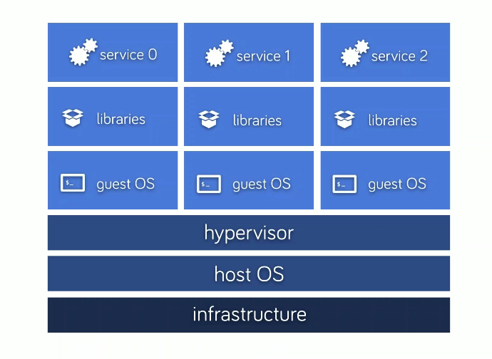
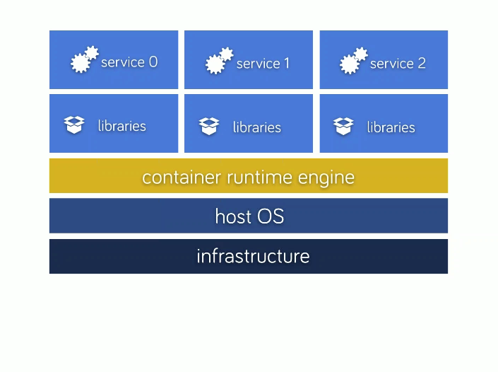

# Docker training basics for dev worklows

## TODO Intro

1.  Docker basics
    -   VM vs containers

        [](res/docker-training-vm.png)
        [](res/docker-training-containers.png)

2.  Structure: Images vs containers

    - Image: like class in programming
    - Container: Instance

    We're storing, pushing, changing classes, but not runned instances
    (we need to rebuild)

1.  Containers Repository

    <https://hub.docker.com/>

## Running existing containers

run ubuntu with sth..

```
docker run ubuntu cat /etc/passwd
docker run ubuntu apt-get
docker run -it ubuntu /bin/bash
```

## Creating First container with CMD

-   Shell app

Add lines to `Dockerfile`
```
FROM ubuntu:latest
CMD date
```
next you'll need to run

```
docker build -t cmd .
docker run cmd
```

When we pass additional parameters We override CMD section.

```
docker run cmd ls -la
```


## ENTRYPOINT

We can set entrypoint for our app (default is `/bin/sh -c`)
`CMD` will be appended.

```
FROM ubuntu:latest

ENTRYPOINT ["date", "-R"]
CMD ["-u"]
```

you can override command passing additional parameters after run:

```
docker run ep --date='@1417400000'
```


## Simple web app

### Building inside conatainer

First we build our statically linked `app.go` file:

```
package main

import (
	"fmt"
	"net/http"
)

func handler(w http.ResponseWriter, r *http.Request) {
	fmt.Fprintf(w, "Hi %s! You motherfucker!", r.URL.Path[1:])
}

func main() {
	http.HandleFunc("/", handler)
	http.ListenAndServe(":8080", nil)
}
```

With `go build -o app` You'll receive `app` binary which will be used in our
docker container. We'll add file inside our container on build

```
FROM ubuntu:latest
ADD ./app /srv/app
CMD /srv/app
```

```
docker build -t swa .
```

We run our container with name

```
docker run --name=gogo swa
```


Now when we propagate container it'll be freezed inside it.

### Getting to our container network

Ok we've run our web app, It's working but how to show it in browser? We'll need
our container IP address:

```
docker inspect --format='{{range .NetworkSettings.Networks}}{{.IPAddress}}{{end}}' gogo
```
result:

```
172.17.0.4
```

http://172.17.0.4:8080/allaallalal


## Data volumes

### Mounting local path inside container for devlopment

We can run our container with local volume mounted inside our container

## Container based volumes

## PHP App with mysql

-   First app without compose

## Binding ports

- `-P` bind all ports to local machine high ports (from ephemeral port range which typically ranges from 32768 to 61000)
- `-p 5000` binds port 5000 from container to high port
- `-p 4900:5000` binds port 5000 from container to 4900 port on local machine


## Connection containers - Networking

In docker 1.8 and below links between containers was used, You'll need
to explicitly set link between two containers.

From 1.9 valid connection between containers is make with use of networking
First create network:

    docker network create training1

Then you'll need to pass `--net=training1` to `docker run` command


### Docker compose

When you run `docker-compose --x-networking up` in `myapp` directory, the following happens:

- A network called myapp is created.
- A container is created using web’s configuration. It joins the network myapp under the name myapp_web_1.
- A container is created using db’s configuration. It joins the network myapp under the name myapp_db_1.


## Localhost integration (--net=host)


## Pushing your image to public

Get your image id

```
docker images | less
```


Make tag

```
                              docker hub username
                            /      repo name
                           /     /    tag name
                          /     /   /
docker tag e701985f4a8c ex00/emacs:v1
               \
                image id


```

Login to hub and publish your image

```
docker login --username=ex00 --email=jacek.wysocki@gmail.com
docker push
```


## Your images are big

You can use micro base images:

- `phusion/baseimage` ~6MB with apt-get based on ubuntu lts. with init process
- `gliderlabs/alpine` ~ 5MB base image


## playing with Docker-compose scale

## Scaling single-core apps with static docker config

- http://blog.hypriot.com/post/docker-compose-nodejs-haproxy/


# Useful images

* Consul
  - https://hub.docker.com/r/voxxit/consul/
  - old: https://hub.docker.com/r/progrium/consul/
* Registrator
  - http://gliderlabs.com/registrator/latest/user/quickstart/
* PHP
* Webservers / Load balancers
