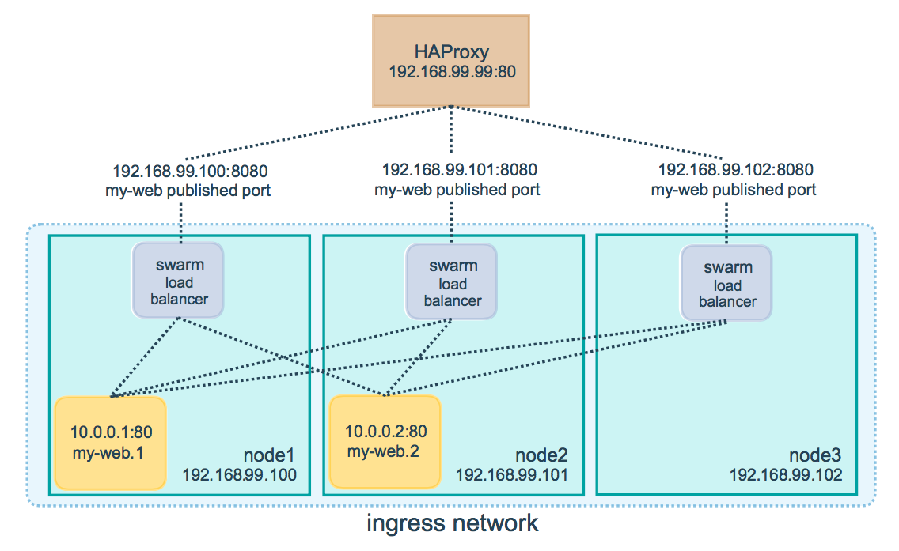

# What's Docker 

## Docker architecture

[](res/docker-architecture.svg)

Docker parts: 
- *Docker daemon* - manages docker objects
- *Docker client* - cli for interacting with docker
- *Docker registries* - stores docker images
- *Docker objects* - when interacting with Docker you're managing objects. There are several types of objects
  - *Images* - template with instructions how to create docker container
  - *Containers* - is a runnable instance of an _Image_
  - *networks*, 
  - *volumes*, 
  - *plugins*, 

## Why Docker? It's all about standards and resource utilisation.

-   VM vs containers

[](res/docker-training-vm.png)

[](res/docker-training-containers.png)


- Additionally whole ecosystem (container registries, schedulers) is also helpful


# Hands on Docker examples

```
                    ##        .
              ## ## ##       ==
           ## ## ## ##      ===
       /""""""""""""""""\___/ ===
  ~~~ {~~ ~~~~ ~~~ ~~~~ ~~ ~ /  ===- ~~~
       \______ o          __/
         \    \        __/ 
          \____\______/
```

We'll go over most useful commands of docker but you need to know that there is
a lot more than those was shown here:
https://docs.docker.com/engine/reference/commandline/docker/

## Docker Repositories

There is huge containers repository with official and unofficial images,
here you can find many of prebuild container images with different linux
distributions, web servers, applications, databases, production ready
systems and many many more.

<https://hub.docker.com/>

now let's run some containers

### Running existing containers

But how containers work? Let's start with really simple

example:

run ubuntu with sth..

``` sh
docker run ubuntu cat /etc/passwd
docker run ubuntu apt-get
docker run -it ubuntu /bin/bash
```

What's happen when you're running docker containers?
- first docker will check if there is image which you want to run available
- if it is not it'll check if there are parts of images available 
- if not it downloads all needed parts of image 
- docker starts your image with given `cmd` (last passed parameter in examples
  above)

what is important `run` runs your image in *NEW* container each time you run
`docker run` command


## Excercise
``` 
  ____ _____   __  _            _ 
 |  _ \_ _\ \ / / | |_ __ _ ___| | __
 | | | | | \ V /  | __/ _` / __| |/ /
 | |_| | |  | |   | || (_| \__ \   < 
 |____/___| |_|    \__\__,_|___/_|\_\
```

Run several containers on your machine

``` sh
docker run ubuntu ls -la
docker run -it ubuntu /bin/bash
docker run alpine ls -la
docker run php:cli php -r 'print_r(["some"=>"var"]);'
docker run composer
```

try something what will be useful for you


## Docker run reference 

There is a lot more options - but most of them you'll use in edge cases 
or never (but it's worth to be aware of them): 

https://docs.docker.com/engine/reference/commandline/run/


## Simple first run [Dockerfile](001-simple-dockerfile/Dockerfile)

Running images with command line is good when you want to check or debug
something quickly, but the main purpose of Docker is to make your application 
to be immutable with all dependencies (the system libs too)

To define such image you'll need some DSL. `Dockerfile` is such DSL in Docker.

Simplest Dockerfile could look like this: 

first create new Dockerfile `touch Dockerfile`

Add lines to `Dockerfile`
```
FROM ubuntu:latest
CMD date
```
next you'll need to build your image from Dockerfile and run built image.

```
docker build -t cmd .
docker run cmd
```

When we pass additional parameters We override CMD section.

```
docker run cmd ls -la
```

- Building with `docker build -t TAG_NAME`.
- Running  with `docker run TAG_NAME`


## Entrypoints [Dockerfile](002-entrypoint/Dockerfile)

Default entrypoing in docker is `/bin/sh -c` which simply runs command passed to `CMD` instruction


We can set entrypoint for our app (default is `/bin/sh -c`)
`CMD` will be appended.

```
FROM ubuntu:latest

ENTRYPOINT ["date", "-R"]
CMD ["-u"]
```

you can override command passing additional parameters after run:

```
docker build -t ep .
docker run ep --date='@1417400000'
```


## Inserting editor inside docker [Dockerfile](003-editor/Dockerfile)
 
You can run almost all applications / services in Docker. But sometimes you'll 
need to attach TTY to your docker container 

- build with `docker build -t editor` 
- run with `docker run -it editor`

## Docker images (ubuntu vs alpine vs debian vs scratch)

You need be careful in your choice of base docker image - they can be huge, 
and you for sure don't want to pass so big images through your network.

Please build image based on `ubuntu` next run one based on `alpine` images

``` Dockerfile
FROM alpine:3

RUN apk add curl

CMD curl ifconfig.co
```

``` Dockerfile
FROM ubuntu:latest

RUN apt update          # ubuntu doesn't update package urls by default
RUN apt install -y curl

CMD curl ifconfig.co
```


``` sh
$ docker build -t size-ubuntu -f Dockerfile.ubuntu .
$ docker build -t size-alpine -f Dockerfile.alpine .
```

Next check `docker images` command to check image size:

``` sh
$ docker images | head -n 5
```

## Excercise

``` 
  ____ _____   __  _            _ 
 |  _ \_ _\ \ / / | |_ __ _ ___| | __
 | | | | | \ V /  | __/ _` / __| |/ /
 | |_| | |  | |   | || (_| \__ \   < 
 |____/___| |_|    \__\__,_|___/_|\_\
```

Create `Dockerfile` which will get latest currency rates on 
run https://api.frankfurter.app/latest
You can use curl, wget, or whatever is ok for you.

DoD: 
- image as small as possible
- docker run should return json response


## Long running processes in Docker

Recently our all examples was for running single run commands which ends their
life after execution. But often we'll be dealing with images which have some
long running processes. 

For this example we'll lock our Docker Image with some simple `sleep` command

``` Dockerfile
FROM alpine:3 

CMD ["tail", "-f", "/dev/stdout"] # tail -f will output if new lines will be
                                  # available and it'll lock our process
```

``` sh
$ docker build -t tail . 
$ docker run -it tail
```

Now we can go to new Terminal and check what's going on with that process.

``` sh
$ docker ps

# command output
CONTAINER ID        IMAGE               COMMAND                 CREATED             STATUS              PORTS               NAMES
72532d002a16        long                "tail -f /dev/stdout"   7 seconds ago       Up 6 seconds                            elegant_kilby
01029e402dde        ubuntu              "/bin/sh"               30 minutes ago      Up 30 minutes                           optimistic_morse

```

as we can se on my machine example output shows that there are two images:
- first was created 7 seconds ago
- second was run 30 minutes ago
- please notice that docker generetes random `NAME` for each container 

now we can check whats going on our run container

``` sh
#              attach terminal from our container
#               /
$ docker exec -it 72532d002a16 /bin/sh
#                    /            \ 
#               conainer ID      command 
#               or name
```

`docker exec` runs command inside working container
we're running here shell inside container (`-it` is needed to attach our shell
to docker shell)

## Named conainers

Running `docker exec` with conintaer ID passed (or random name) could be quite inconvinient - but there
is a nice option when running containers `--name` which sets a custom name for
container. 

``` sh
$ docker run --rm --name tailer tail
```

``` sh
$ docker ps 
CONTAINER ID        IMAGE               COMMAND                 CREATED             STATUS              PORTS               NAMES
8954e7811347        tail                "tail -f /dev/stdout"   6 seconds ago       Up 5 seconds                            tailer

```

as we can see that container `NAME` is set, now we can use it instead of ID's

e.g. 

``` sh
$ docker exec -it tailer /bin/sh
```


## Excercise 

``` 
  ____ _____   __  _            _ 
 |  _ \_ _\ \ / / | |_ __ _ ___| | __
 | | | | | \ V /  | __/ _` / __| |/ /
 | |_| | |  | |   | || (_| \__ \   < 
 |____/___| |_|    \__\__,_|___/_|\_\
```

Copy your previous container (or create new one) 

Change your API to sth like this: 

https://api.countapi.xyz/hit/pandagroupco/docker


Create second container which will listen for your hits

https://api.countapi.xyz/get/pandagroupco/docker

DoD:
- run listener container in a loop 
- make interval of 1 second with `sleep 1`


## Docker containers are immutable 

File system in docker containers is temporary by default (exception here are data volumes). 
When you stop container and start again all data will be lost same will happen with new instance of class in OOP. Persistance here is made on building process.

If you change something in your docker images it'll simply lost after docker container will be reloaded. 

``` sh
echo "some file" >> some_file.txt
echo "content" >> some_file.txt
echo "and more content" >> some_file.txt
```

``` Dockerfile
FROM alpine:3
COPY some_file.txt /
CMD tail -f /some_file.txt
```

``` sh
$ docker build -t immutable .
$ docker run -it --name im1 --rm immutable
```

next you can modify content of this container from other terminal session

``` sh
$ docker exec -it im1 /bin/sh
```

and add some files to our `some_file.txt` inside container

``` sh
$ echo "another line" >> /some_file.txt
$ echo "another line" >> /some_file.txt
$ echo "another line" >> /some_file.txt
$ echo "another line" >> /some_file.txt
$ echo "another line" >> /some_file.txt
```

as you can see on first terminal our file got new lines - file was modified

Now let's restart our container

``` sh
$ docker kill im1
$ docker run --rm --name im1 immutable
```

Let's get to its shell again:
``` sh
$ docker exec -it im1 /bin/sh
```


``` sh
$ cat /some_file.txt
some file
content
and more content
```
as we can see after container restart file is not changed

Example - [Dockerfile](050-immutable-images/Dockerfile)

## Docker persistance

If you want to persist your data you'll need to use volumes or mounts we'll look at volumes first. 
It's like attaching new disk to your PC. You can attach multiple volumes to multiple directories.


There are two types of mounts
- bind mount
- volume


Volumes are the *preferred mechanism for persisting data* generated by and used by
Docker containers. While bind mounts are dependent on the directory structure of 
the host machine, volumes are completely managed by Docker.

### Creating new volumes

You can explicitly create new named volumes: 

- craete new volume
``` sh
$ docker volume create myvol

myvol
```

- list created volumes
``` sh
$ docker volume ls 

DRIVER              VOLUME NAME
local               myvol                                                                                                                             
```

- inspect volume
``` sh
$ docker volume inspect myvol

[                                                                                                                                                     
    {                                                                                                                                                 
        "CreatedAt": "2020-02-01T08:03:58+01:00",                                                                                                     
        "Driver": "local",                                                                                                                            
        "Labels": {},                                                                                                                                 
        "Mountpoint": "/var/snap/docker/common/var-lib-docker/volumes/myvol/_data",                                                                   
        "Name": "myvol",
        "Options": {},
        "Scope": "local"
    }
]
```

- remove created volume
``` sh
$ docker volume rm myvol 

myvol
```


### Attaching volumes to conainer

``` sh
$ docker volume create vol1
```


``` sh
$ docker run -d \
  --name devtest \
  --mount source=vol1,target=/app \
  nginx:latest
```

Next lets run another container which will use our volume.

``` sh
$ docker run -it --mount source=vol1,destination=/mymount ubuntu /bin/sh
```

#### Some tips form docker site:
- Named volues are a lot easier to use and backup
- Originally, the -v or --volume flag was used for standalone containers and the
  --mount flag was used for swarm services. However, starting with Docker 17.06,
  you can also use --mount with standalone containers. In general, --mount is
  more explicit and verbose. The biggest difference is that the -v syntax
  combines all the options together in one field, while the --mount syntax
  separates them. Here is a comparison of the syntax for each flag.
- New users should try --mount syntax which is simpler than --volume syntax.


### Bind mounts 

The file or directory is referenced by its **full or relative path on the host
machine**. 

By contrast, when you use a volume, a new directory is created within
Docker’s storage directory on the host machine, and Docker manages that
directory’s contents.

To bind mount you can use `-v` paramter, values are separated by `:`
In the case of bind mounts, 
- the first field is the **path** to the file or directory on the **host machine**.
- The second field is the **path** where the file or directory is **mounted in the container**.
- The third optional is and is comma separated **list of options**.


to bind mount directory from local filesystem use following command: 

``` sh
#                   need to be full path
#                       /
$ docker run -it -v $(pwd)/dirToMount:/whereToMountInContainer ubuntu
#                              /           \
#                            local          container 
```

local dir will bin bound to container
volumes are often used to quickly run your apps with local configuration or to
debug changes


### Drivers 

There are many drivers for volumes, you can even use S3 or GCS
- https://docs.docker.com/registry/storage-drivers/gcs/


## Excercise
``` 
  ____ _____   __  _            _ 
 |  _ \_ _\ \ / / | |_ __ _ ___| | __
 | | | | | \ V /  | __/ _` / __| |/ /
 | |_| | |  | |   | || (_| \__ \   < 
 |____/___| |_|    \__\__,_|___/_|\_\
```

Get your previous API example, modify it to write data into your local
filesystem. Use bind mounts. (`-v` flag)

DoD: 
- write each call to API to file with  `>> some_file.txt` after API call
- file need to be persisted after container restart


## `Dockerfile` reference 

We've learned several Dockerfile instructions in previous examples. But
Dockerfile has more options to use. 

### Build context

When you issue a docker build command, the **current working directory** is called
the **build context**. By default, the Dockerfile is assumed to be located here, but
you can specify a different location with the file flag (`-f`). 

Regardless of where the Dockerfile actually lives, all recursive contents of files and
directories in the current directory are sent to the Docker daemon as the build
context.

Do if your project is quite big it could be quite slow when you're running
`docker build` command. 

``` sh
$ docker build .
Sending build context to Docker daemon  6.51 MB
```

How to limit your build context? Simply use `.dockerignore` file, it's working like
.gitignore but for Docker context - you can easily limit not needed files and
directories like caches, intermediate build files or temporary directories.


  
## Dockerfile commands 

Docker file is based on instructions (you've seen them above of this document)

``` Dockerfile
# Comment
INSTRUCTION arguments
```

There are many instructions: 

### `FROM`

e.g. `FROM ubuntu:tag`, `FROM ubuntu:20.04 as newUbuntu`, `FROM ubuntu@j2j43r0924i3ir0234r092i43r`

You can use arguments with FROM: 
``` Dockerfile
ARG  CODE_VERSION=latest
FROM base:${CODE_VERSION}
```


### `RUN`
RUN has 2 forms:

``` Dockerfile
RUN <command> #(shell form, the command is run in a shell, which by default is /bin/sh -c on Linux or cmd /S /C on Windows)
RUN ["executable", "param1", "param2"] #(exec form)
```

**Layering** RUN instructions and generating commits conforms to the core concepts
of Docker where commits are **cheap** and containers can be created from any point
in an image’s history, much like source control.


### `CMD`
The CMD instruction has three forms:

``` Dockerfile
CMD ["executable","param1","param2"] #(exec form, this is the preferred form)
CMD ["param1","param2"] #(as default parameters to ENTRYPOINT)
CMD command param1 param2 #(shell form)
```

**The main purpose of a CMD is to provide defaults for an executing container**.
These defaults can include an executable, or they can omit the executable, in
which case you must specify an ENTRYPOINT instruction as well.


### `LABEL`

The LABEL instruction adds metadata to an image. A LABEL is a key-value pair. To
include spaces within a LABEL value, use quotes and backslashes as you would in
command-line parsing. A few usage examples:

``` Dockerfile
LABEL maintainer="jacek.wysocki@gmail.com"
LABEL "com.doctrime.version"="1.4.55-build-153"
LABEL com.example.label-with-value="foo"
LABEL version="1.0"
LABEL description="New basket service \
will replace part of monolith after implementing currency panel."
```

### `EXPOSE`

The EXPOSE instruction informs Docker that the container listens on the
specified network ports at runtime. You can specify whether the port listens on
TCP or UDP, and the default is TCP if the protocol is not specified

The EXPOSE instruction does not actually publish the port. It functions as a
type of documentation between the person who builds the image and the person who
runs the container, about which ports are intended to be published

``` Dockerfile
EXPOSE 8080
```

### `ENV`

The ENV instruction sets the environment variable <key> to the value <value>. 


``` Dockerfile
ENV myName John Doe
ENV myDog Rex The Dog
ENV myCat fluffy
```

The environment variables set using ENV will persist when a container is run
from the resulting image. You can view the values using docker inspect, and
change them using `docker run --env <key>=<value>`


You can replace defined envs inline details about rules can br found in docs:
https://docs.docker.com/engine/reference/builder/#environment-replacement


### `ADD`

The ADD instruction copies new files, directories or remote file URLs from <src>
and adds them to the filesystem of the image at the path <dest>.


ADD has two forms:

``` Dockerfile
ADD [--chown=<user>:<group>] <src>... <dest>
ADD [--chown=<user>:<group>] ["<src>",... "<dest>"] # (this form is required for paths containing whitespace)
```

Some examples: 

``` Dockerfile
ADD hom* /mydir/        # adds all files starting with "hom"
ADD hom?.txt /mydir/    # ? is replaced with any single character, e.g., "home.txt"

ADD test relativeDir/          # adds "test" to `WORKDIR`/relativeDir/
ADD test /absoluteDir/         # adds "test" to /absoluteDir/

ADD --chown=55:mygroup files* /somedir/
ADD --chown=bin files* /somedir/
ADD --chown=1 files* /somedir/
ADD --chown=10:11 files* /somedir/

ADD http://sources.file/somefile.txt /somedir/
ADD superarchive.tar.gz /somedir/
```

There are some limitations about add `src` and `dest` which you can find in
docs: https://docs.docker.com/engine/reference/builder/#add


### `COPY`

COPY is very similiar to add but allow to insert into container only files which
are in context. 

### `ENTRYPOINT`

``` Dockerfile
ENTRYPOINT ["executable", "param1", "param2"] #(exec form, preferred)
ENTRYPOINT command param1 param2 #(shell form)
```


Example:
``` Dockerfile
FROM ubuntu
ENTRYPOINT ["top", "-b"]
CMD ["-c"]
```

Both `CMD` and `ENTRYPOINT` instructions define what command gets executed when
running a container. There are few rules that describe their co-operation.

- `Dockerfile` should specify at least one of `CMD` or `ENTRYPOINT` commands.
- `ENTRYPOINT` should be defined when using the container as an executable.
- `CMD` should be used as a way of defining default arguments for an `ENTRYPOINT` command or for executing an ad-hoc command in a container.
- `CMD` will be overridden when running the container with alternative arguments.

### `VOLUME`

The `VOLUME` instruction creates a mount point with the specified name and marks
it as holding externally mounted volumes from native host or other containers.
The value can be a JSON array, `VOLUME ["/var/log/"]`, or a plain string with
multiple arguments, such as `VOLUME /var/log` or `VOLUME /var/log /var/db`.

For more information/examples and mounting instructions via the Docker client,
refer to [Share Directories via Volumes documentation](https://docs.docker.com/engine/tutorials/dockervolumes/).


``` Dockerfile
FROM ubuntu
RUN mkdir /myvol
RUN echo "hello world" > /myvol/greeting
VOLUME /myvol
```

This Dockerfile results in an image that causes docker run to create a new mount
point at `/myvol` and copy the greeting file into the newly created volume.


### `USER`

``` Dockerfile
USER <user>[:<group>] or
USER <UID>[:<GID>]
```

### `WORKDIR`
  

The `WORKDIR` instruction sets the working directory for any `RUN`, `CMD`, `ENTRYPOINT`,
`COPY` and `ADD` instructions that follow it in the Dockerfile. If the `WORKDIR`
doesn’t exist, it will be created even if it’s not used in any subsequent
Dockerfile instruction.

``` Dockerfile
ENV DIRPATH /path
WORKDIR $DIRPATH/$DIRNAME
RUN pwd
WORKDIR /someroot
RUN ls -la 
WORKDIR /
```

### `ARG`

The `ARG` instruction defines a variable that users can pass at build-time to the
builder with the docker build command using the `--build-arg <varname>=<value>`
flag. 

``` Dockerfile
FROM busybox
ARG user1=jacekwysocki
ARG gitHash=ii3e09i329e23
ARG buildno=19320
RUN echo "${buildno}"
```

### `ONBUILD`

The `ONBUILD` instruction adds to the image a trigger instruction to be executed
at a later time, when the **image is used as the base for another build**. 

The trigger will be executed in the context of the downstream build, as if it
had been inserted immediately after the FROM instruction in the downstream Dockerfile.

``` Dockerfile
ONBUILD RUN /usr/local/bin/python-build --dir /app/src
```


### `STOPSIGNAL`

The STOPSIGNAL instruction sets the system call signal that will be sent to the
container to exit. This signal can be a valid unsigned number that matches a
position in the kernel’s syscall table, for instance 9, or a signal name in the
format SIGNAME, for instance SIGKILL.

### `HEALTHCHECK`

``` Dockerfile
HEALTHCHECK --interval=5m --timeout=3s \
  CMD curl -f http://localhost/ || exit 1
```

To help debug failing probes, any output text (UTF-8 encoded) that the command
writes on stdout or stderr will be **stored** in the **health status** and can be
queried with docker inspect. Such output should be kept short (only the first
4096 bytes are stored currently).

[Healthcheck example](075-healthcheck)


## Dockerfile good practices


### Building images 

- Start with an appropriate base image
- Use multistage builds. 
- If you need to use a version of Docker that does not include multistage builds, try to reduce the number of layers in your image by minimizing the number of separate RUN commands in your Dockerfile. 
- To keep your production image lean but allow for debugging, consider using the production image as the base image for the debug image. Additional testing or debugging tooling can be added on top of the production image.
- When building images, always tag them with useful tags which codify version
information, intended destination (prod or test, for instance), stability, or
other information that is useful when deploying the application in different
environments. 
- Do not rely on the automatically-created latest tag.
- Use volumes on production / bind mount on dev environments.


# Creating web applications

Web apps will be often composed from several containsers 
working together in some network. Let's try to create some of them:

```
                    ##        .
              ## ## ##       ==
           ## ## ## ##      ===
       /""""""""""""""""\___/ ===
  ~~~ {~~ ~~~~ ~~~ ~~~~ ~~ ~ /  ===- ~~~
       \______ o          __/
         \    \        __/ 
          \____\______/
```


## Creating Simple PHP Web application [Dockerfile](030-php-app/Dockerfile)

Create `index.php` file 

``` php
<?php

echo "<h1 style='color:#ff44dd'>Helloł!!!!</h1>";
phpinfo();
```


``` Dockerfile
FROM php:7-apache

ADD index.php /var/www/html/
```

next run build and run our new PHP container


## Getting our container IP address

Ok we've run our web app, It's working but how to show it in browser? We'll need
our container IP address:

```
docker inspect
```

We can filter inspected data with format parameter: 

```
docker inspect --format='{{range .NetworkSettings.Networks}}{{.IPAddress}}{{end}}' $INSTANCE_ID
```

result:

```
172.17.0.4
```

http://172.17.0.4:8080/allaallalal


## Binding ports

- `-P` bind all ports to local machine high ports (from ephemeral port range which typically ranges from 32768 to 61000)
- `-p 5000` binds port 5000 from container to high port
- `-p 4900:5000` binds port 5000 from container to 4900 port on local machine


## Connections between containers - Networking [Code Example](./061-networking/)

In docker 1.8 and below links between containers was used, You'll need
to explicitly set link between two containers.

From 1.9 valid connection between containers is make with use of networking
First create network:

    docker network create training1

Then you'll need to pass `--network=training1` to `docker run` command

You can also run container as part of your local network (`--net=host`)


## Docker multi stage builds 

Before version 17 if we wanted to make smaller images we need clear 
our build images from unnecessary stuff on for production builds, 
or split build and production images build. 

From version 17.05 we can make our life a lot simplier with use of 
multi-stage builds

I've prepared 2 examples of multi stage builds: 
First will be based on compiled go based image (but mechanics will be the same
for almost all modern compiled languages like Java, Rust, Kotlin, Clojure, C#
etc)

- [Golang based multi stage build](./080-multi-stage-builds/golang/)

Second one is for use with nodejs based build of Vue frontend application

- [Vue based multi stage build](./080-multi-stage-builds/vue/)


# Pushing your images 

We'll use in this example public repo from https://hub.docker.com 
To publish on dokcer hub we need to create account. 

Next login to hub and publish your image:

```
$ docker login 
Login with your Docker ID to push and pull images from Docker Hub. If you don't have a Docker ID, head over to https://hub.docker.com to create one.
Username: ex00
Password: 
WARNING! Your password will be stored unencrypted in /home/exu/snap/docker/423/.docker/config.json.
Configure a credential helper to remove this warning. See
https://docs.docker.com/engine/reference/commandline/login/#credentials-store

Login Succeeded

```

Get your image id:

```
docker images | less
```


Make tag

``` sh
# docker tag SOURCE_IMAGE[:TAG] TARGET_IMAGE[:TAG]
# 
#                              docker hub username
#                            /      repo name
#                           /     /    tag name
#                          /     /   /
docker tag e701985f4a8c ex00/emacs:v1
#               \
#                image id or tag/name given on build
```


``` sh
docker push ex00/emacs:v1
```

## Excercise
``` 
  ____ _____   __  _            _ 
 |  _ \_ _\ \ / / | |_ __ _ ___| | __
 | | | | | \ V /  | __/ _` / __| |/ /
 | |_| | |  | |   | || (_| \__ \   < 
 |____/___| |_|    \__\__,_|___/_|\_\
```

Take your last API based container 
Tag it and push to your container regitry account

DoD: 
- container downloadable and runnable by others


# Docker Compose

Compose is a tool for defining and running multi-container Docker applications.
With Compose, you use a YAML file to configure your application’s services.
Then, with a single command, you create and start all the services from your
configuration.


## Compose Example - PHP app with Redis [Example](./101-compose-app/)

Docker compose files are created in YAML format

``` yaml
version: '3'
services:
  web:
    build: .
    ports:
      - "8080:80"
  redis:
    image: "redis:alpine"
```

`build: .` will use `Dockerfile in current directory`

Our `Dockerfile` will install Redis extension and add `index.php` file 

In index file we'll define Redis as session save handler.

``` php
ini_set('session.save_handler', 'redis');
ini_set('session.save_path', 'tcp://redis:6379,tcp://redis:6379');

session_name('FOOBAR');
session_start();

if (!array_key_exists('visit', $_SESSION)) {
    $_SESSION['visit'] = 0;
}
$_SESSION['visit']++;

echo nl2br('You have been here ' . $_SESSION['visit'] . ' times.');
```


With such application defined we can run 

``` sh
docker-compose up
```

Which builds, (re)creates, starts, and attaches to containers for a service.

## Docker Compose file reference

### `build` configuration

We use build for our custom containers

``` docker-compose.yaml
version: "3.7"
services:
  webapp:
    build:
      context: ./dir
      dockerfile: Dockerfile-alternate
      args:
        buildno: 1
      labels:
        maintainer: docker@pandagroup.co
      shm_size: '2gb'
```


- `context` build context path
- `dockerfile` - path of Dockerfile
- `shm_size` - temporary `/dev/shm` size in container

### `image` when we want to load image form docker hub

### `container_name` to change container autogenerated name


## How to run Magento

https://hub.docker.com/r/bitnami/magento/ 

Bitnami prepared docker images for magento (we can try to run them after)
Because it's more complicated and uses docker compose we can try to run 
it after trying Docker Compose.


## Useful containers: 

### Elastic - official image

https://hub.docker.com/_/elasticsearch


Lets run it on our host (`--net host`)

``` sh
docker run -d --rm --name elasticsearch --net host -p 9200:9200 -p 9300:9300 -e "discovery.type=single-node" elasticsearch:7.5.2
```

now we can check if it's working ok.

``` sh
curl localhost:9200 
# post something
curl -H Content-Type:application/json -d '{"name":"Panda"}' localhost:9200/index/create/logs 
```


### Composer / dealing with fs as user

https://hub.docker.com/_/composer 

By default docker runs it's images as root user (uid:1 gid:1) but when 
we're dealing with project directory we often want to work on files with 
current user

``` sh
docker run --rm -it -v $(pwd):/app --user $(id -u):$(id -g) composer install
```

with `--user` flag we can override default (root) user and group when 
interacting with files

`composer` is the composer image (with `composer` binary entrypoint)
`install` is composers command 


### Magento 

https://hub.docker.com/r/bitnami/magento/ 

Bitnami prepared docker images for magento (we can try to run them after)
Because it's more complicated and uses docker compose we can try to run 
it after trying Docker Compose.


# Tools 

- https://github.com/wagoodman/dive - Dockerfile layers explorer
- `docker run --rm -i hadolint/hadolint < Dockerfile`


# Scheduling - Swarm 

The cluster management and orchestration features embedded in the Docker Engine
are built using swarmkit. Swarmkit is a separate project which implements
Docker’s orchestration layer and is used directly within Docker.

Swarm components:

- Manager node
- Worker nodes
- Services 
- Tasks 
- Load balancing
- DNS 

## Swarm deployment example


### Initializing cluster 

We'll use single node swarm. 

``` sh
docker swarm init
```

this command initializes our swarm cluster (for purpose of this training it'll
be single node cluster)

After creating it gives ou token to join this swarm cluster with given token 
and IP

``` sh
docker swarm join --token SWMTKN-1-6cmxpy48rn6feubpdbn4fpc28jteeapphxjfvkwcl9r12gpbi3-9z19thzamak06ix8mcho77uh5 192.168.1.64:2377
```

you can check if there is Swarm active with `docker info` command 

You can list available nodes in swarm with:
``` sh
docker node ls 

# it give you nodes info 
ID                            HOSTNAME            STATUS              AVAILABILITY        MANAGER STATUS      ENGINE VERSION
l67gorvk2wzys09rcbey2d5a1 *   ion-cannon          Ready               Active              Leader              18.09.9
```


### Create service 

Now we're ready to craete a service:

``` sh
docker service create --replicas 1 --name helloswarm alpine ping pandagroup.co
```

We can inspect created service with 

``` sh
docker service inspect --pretty helloswarm
```

You can also check whats going on in given service (it could be a lot more
complicated than in this example)

``` sh
docker service ps helloswarm
```


### Scaling services 

Currently there is only one instance but we can create a lot more 
When we scale up our containers it's scheduler main task to push those
containers to given nodes in swarm, it'll try to put next instance to node best
suited to deployment

``` sh
docker service scale helloswarm=5
```

check again with ps there will be a lot more instances running 

### Getting logs from containers 

If you can check STDOUT/ERR of running containers you can 
do it with: 

``` sh
docker service logs helloswarm
```

### Removing service 

``` sh
docker service rm helloswarm
```


## Swarm rolling updates

Usually you want to limit downtime of your services, in VPSes we're often doing
some fancy deployment techniqes using different tools like switching DNS entries
to new VPS etc, switching symlinks on given machine etc. 

In Swarm we have rolling updates which are helping us to limit downtimes of our
services 

Let's crate example redis cluster (3 nodes) in some version (let it be 3.0.6)
and after that we'll do upgrade of it to new version (let it be 3.0.7)

``` sh
docker service create \
  --replicas 3 \
  --name redis \
  --update-delay 10s \
  redis:3.0.6
```

let's check this service: 

``` sh
docker service inspect --pretty redis
```

now let's upgrade it 

``` sh
docker service update --image redis:3.0.7 redis
```

The scheduler applies rolling updates as follows by default:
1. Stop the first task.
2. Schedule update for the stopped task.
3. Start the container for the updated task.
4. If the update to a task returns RUNNING, wait for the specified delay period then start the next task.
5. If, at any time during the update, a task returns FAILED, pause the update.


When something is not working properly you can always rollback service 

``` sh
docker service update \
  --rollback \
  --update-delay 0s
  redis
```

### Network 

Swarm use load balancers on each node to forward traffic to given containers
You can put external load balancer (like HAProxy/Nginx or other LB) to forwand
traffic to nodes




Let's assume you have 100 nodes cluster and you'll run 3-task 
nginx based service 

``` sh
docker service create --name my_web \
                        --replicas 3 \
                        --publish published=8080,target=80 \
                        nginx
```

You don't need to know on which node Swarm scheduled your containers swarm load
balancers are responsible for it. 


### Other useful options when running services 

- `--mode` - default `replicated` - you can set to `global` then each node will
  receive instance of service 
- `--reserve-memory` and `--reserve-cpu`

- `--constraint node.labels.region==east` - where to place service
- `--placement-pref` opossite to constraint
While placement constraints limit the nodes a service can run on, placement
preferences try to place tasks on appropriate nodes in an algorithmic way

- `--mount` adds volumes or bind mounts

## Kubernetes

It's a lot more complicated that Swarm.

It has a lot of objects and give you fleibility to crate your own: 
example objects in Kubernetes:

- Container v1 core
- CronJob v1beta1 batch
- DaemonSet v1 apps
- Deployment v1 apps
- Job v1 batch
- Pod v1 core
- ReplicaSet v1 apps
- ReplicationController v1 core
- StatefulSet v1 apps
- SERVICE APIS
- Endpoints v1 core
- EndpointSlice v1beta1 discovery.k8s.io
- Ingress v1beta1 networking.k8s.io
- Service v1 core
- CONFIG AND STORAGE APIS
- ConfigMap v1 core
- CSIDriver v1beta1 storage.k8s.io
- CSINode v1 storage.k8s.io
- Secret v1 core
- PersistentVolumeClaim v1 core
- StorageClass v1 storage.k8s.io
- Volume v1 core
- VolumeAttachment v1 storage.k8s.io
- METADATA APIS
- ControllerRevision v1 apps
- CustomResourceDefinition v1 apiextensions.k8s.io
- Event v1 core
- LimitRange v1 core
- HorizontalPodAutoscaler v1 autoscaling
- MutatingWebhookConfiguration v1 admissionregistration.k8s.io
- ValidatingWebhookConfiguration v1 admissionregistration.k8s.io
- PodTemplate v1 core
- PodDisruptionBudget v1beta1 policy
- PriorityClass v1 scheduling.k8s.io
- PodPreset v1alpha1 settings.k8s.io
- PodSecurityPolicy v1beta1 policy
- CLUSTER APIS
- APIService v1 apiregistration.k8s.io
- AuditSink v1alpha1 auditregistration.k8s.io
- Binding v1 core
- CertificateSigningRequest v1beta1 certificates.k8s.io
- ClusterRole v1 rbac.authorization.k8s.io
- ClusterRoleBinding v1 rbac.authorization.k8s.io
- ComponentStatus v1 core
- FlowSchema v1alpha1 flowcontrol.apiserver.k8s.io
- Lease v1 coordination.k8s.io
- LocalSubjectAccessReview v1 authorization.k8s.io
- Namespace v1 core
- Node v1 core
- PersistentVolume v1 core
- PriorityLevelConfiguration v1alpha1 flowcontrol.apiserver.k8s.io
- ResourceQuota v1 core
- Role v1 rbac.authorization.k8s.io
- RoleBinding v1 rbac.authorization.k8s.io
- RuntimeClass v1beta1 node.k8s.io
- SelfSubjectAccessReview v1 authorization.k8s.io
- SelfSubjectRulesReview v1 authorization.k8s.io
- ServiceAccount v1 core
- SubjectAccessReview v1 authorization.k8s.io
- TokenRequest v1 authentication.k8s.io
- TokenReview v1 authentication.k8s.io
- NetworkPolicy v1 networking.k8s.io
- DEFINITIONS
- OLD API VERSIONS
- APIService v1beta1 apiregistration.k8s.io
- APIServiceCondition v1beta1 apiregistration.k8s.io
- AggregationRule v1beta1 rbac.authorization.k8s.io
- AggregationRule v1alpha1 rbac.authorization.k8s.io
- AllowedCSIDriver v1beta1 extensions
- AllowedFlexVolume v1beta1 extensions
- AllowedHostPath v1beta1 extensions
- CSINode v1beta1 storage.k8s.io
- CSINodeDriver v1beta1 storage.k8s.io
- ClusterRole v1beta1 rbac.authorization.k8s.io
- ClusterRole v1alpha1 rbac.authorization.k8s.io
- ClusterRoleBinding v1beta1 rbac.authorization.k8s.io
- ClusterRoleBinding v1alpha1 rbac.authorization.k8s.io
- ControllerRevision v1beta2 apps
- ControllerRevision v1beta1 apps
- CronJob v2alpha1 batch
- CrossVersionObjectReference v2beta2 autoscaling
- CrossVersionObjectReference v2beta1 autoscaling
- CustomResourceColumnDefinition v1beta1 apiextensions.k8s.io
- CustomResourceConversion v1beta1 apiextensions.k8s.io
- CustomResourceDefinition v1beta1 apiextensions.k8s.io
- CustomResourceDefinitionCondition v1beta1 apiextensions.k8s.io
- CustomResourceDefinitionNames v1beta1 apiextensions.k8s.io
- CustomResourceDefinitionVersion v1beta1 apiextensions.k8s.io
- CustomResourceSubresourceScale v1beta1 apiextensions.k8s.io
- CustomResourceSubresourceStatus v1beta1 apiextensions.k8s.io
- CustomResourceSubresources v1beta1 apiextensions.k8s.io
- CustomResourceValidation v1beta1 apiextensions.k8s.io
- DaemonSet v1beta2 apps
- DaemonSet v1beta1 extensions
- DaemonSetCondition v1beta2 apps
- DaemonSetCondition v1beta1 extensions
- DaemonSetUpdateStrategy v1beta2 apps
- DaemonSetUpdateStrategy v1beta1 extensions
- Deployment v1beta2 apps
- Deployment v1beta1 apps
- Deployment v1beta1 extensions
- DeploymentCondition v1beta2 apps
- DeploymentCondition v1beta1 apps
- DeploymentCondition v1beta1 extensions
- EndpointPort v1beta1 discovery.k8s.io
- Event v1beta1 events.k8s.io
- EventSeries v1beta1 events.k8s.io
- ExternalDocumentation v1beta1 apiextensions.k8s.io
- ExternalMetricSource v2beta1 autoscaling
- ExternalMetricStatus v2beta1 autoscaling
- FSGroupStrategyOptions v1beta1 extensions
- HTTPIngressPath v1beta1 extensions
- HTTPIngressRuleValue v1beta1 extensions
- HorizontalPodAutoscaler v2beta2 autoscaling
- HorizontalPodAutoscaler v2beta1 autoscaling
- HorizontalPodAutoscalerCondition v2beta1 autoscaling
- HostPortRange v1beta1 extensions
- IDRange v1beta1 extensions
- IPBlock v1beta1 extensions
- Ingress v1beta1 extensions
- IngressBackend v1beta1 extensions
- IngressRule v1beta1 extensions
- IngressTLS v1beta1 extensions
- JSON v1beta1 apiextensions.k8s.io
- JSONSchemaProps v1beta1 apiextensions.k8s.io
- JSONSchemaPropsOrArray v1beta1 apiextensions.k8s.io
- JSONSchemaPropsOrBool v1beta1 apiextensions.k8s.io
- JobTemplateSpec v2alpha1 batch
- Lease v1beta1 coordination.k8s.io
- LocalSubjectAccessReview v1beta1 authorization.k8s.io
- MetricSpec v2beta1 autoscaling
- MetricStatus v2beta1 autoscaling
- MutatingWebhook v1beta1 admissionregistration.k8s.io
- MutatingWebhookConfiguration v1beta1 admissionregistration.k8s.io
- NetworkPolicy v1beta1 extensions
- NetworkPolicyEgressRule v1beta1 extensions
- NetworkPolicyIngressRule v1beta1 extensions
- NetworkPolicyPeer v1beta1 extensions
- NetworkPolicyPort v1beta1 extensions
- NonResourceAttributes v1beta1 authorization.k8s.io
- NonResourceRule v1beta1 authorization.k8s.io
- ObjectMetricSource v2beta1 autoscaling
- ObjectMetricStatus v2beta1 autoscaling
- Overhead v1alpha1 node.k8s.io
- PodSecurityPolicy v1beta1 extensions
- PodsMetricSource v2beta1 autoscaling
- PodsMetricStatus v2beta1 autoscaling
- PolicyRule v1beta1 rbac.authorization.k8s.io
- PolicyRule v1alpha1 rbac.authorization.k8s.io
- PriorityClass v1beta1 scheduling.k8s.io
- PriorityClass v1alpha1 scheduling.k8s.io
- ReplicaSet v1beta2 apps
- ReplicaSet v1beta1 extensions
- ReplicaSetCondition v1beta2 apps
- ReplicaSetCondition v1beta1 extensions
- ResourceAttributes v1beta1 authorization.k8s.io
- ResourceMetricSource v2beta1 autoscaling
- ResourceMetricStatus v2beta1 autoscaling
- ResourceRule v1beta1 authorization.k8s.io
- Role v1beta1 rbac.authorization.k8s.io
- Role v1alpha1 rbac.authorization.k8s.io
- RoleBinding v1beta1 rbac.authorization.k8s.io
- RoleBinding v1alpha1 rbac.authorization.k8s.io
- RoleRef v1beta1 rbac.authorization.k8s.io
- RoleRef v1alpha1 rbac.authorization.k8s.io
- RollbackConfig v1beta1 extensions
- RollingUpdateStatefulSetStrategy v1beta2 apps
- RollingUpdateStatefulSetStrategy v1beta1 apps
- RuleWithOperations v1beta1 admissionregistration.k8s.io
- RunAsGroupStrategyOptions v1beta1 extensions
- RunAsUserStrategyOptions v1beta1 extensions
- RuntimeClass v1alpha1 node.k8s.io
- RuntimeClassStrategyOptions v1beta1 extensions
- SELinuxStrategyOptions v1beta1 extensions
- Scale v1 autoscaling
- Scale v1beta1 apps
- Scale v1beta1 extensions
- Scheduling v1alpha1 node.k8s.io
- SelfSubjectAccessReview v1beta1 authorization.k8s.io
- SelfSubjectRulesReview v1beta1 authorization.k8s.io
- ServiceReference v1 apiextensions.k8s.io
- ServiceReference v1 apiregistration.k8s.io
- ServiceReference v1beta1 admissionregistration.k8s.io
- ServiceReference v1beta1 apiextensions.k8s.io
- ServiceReference v1beta1 apiregistration.k8s.io
- ServiceReference v1alpha1 auditregistration.k8s.io
- StatefulSet v1beta2 apps
- StatefulSet v1beta1 apps
- StatefulSetCondition v1beta2 apps
- StatefulSetCondition v1beta1 apps
- StatefulSetUpdateStrategy v1beta2 apps
- StatefulSetUpdateStrategy v1beta1 apps
- StorageClass v1beta1 storage.k8s.io
- Subject v1 rbac.authorization.k8s.io
- Subject v1beta1 rbac.authorization.k8s.io
- Subject v1alpha1 rbac.authorization.k8s.io
- SubjectAccessReview v1beta1 authorization.k8s.io
- SubjectRulesReviewStatus v1beta1 authorization.k8s.io
- SupplementalGroupsStrategyOptions v1beta1 extensions
- TokenReview v1beta1 authentication.k8s.io
- UserInfo v1beta1 authentication.k8s.io
- ValidatingWebhook v1beta1 admissionregistration.k8s.io
- ValidatingWebhookConfiguration v1beta1 admissionregistration.k8s.io
- VolumeAttachment v1beta1 storage.k8s.io
- VolumeAttachment v1alpha1 storage.k8s.io
- VolumeAttachmentSource v1beta1 storage.k8s.io
- VolumeAttachmentSource v1alpha1 storage.k8s.io
- VolumeError v1beta1 storage.k8s.io
- VolumeError v1alpha1 storage.k8s.io
- VolumeNodeResources v1beta1 storage.k8s.io
- WebhookClientConfig v1 apiextensions.k8s.io
- WebhookClientConfig v1beta1 admissionregistration.k8s.io
- WebhookClientConfig v1beta1 apiextensions.k8s.io
- WebhookClientConfig v1alpha1 auditregistration.k8s.io

